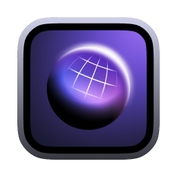
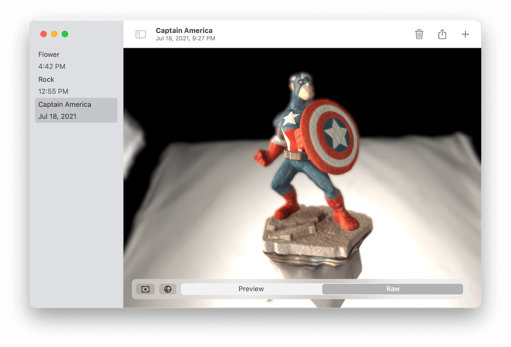

# Solid

Solid creates 3D models from images of an object at different angles. This is made possible by the RealityKit Object Capture API introduced in macOS 12. Solid features creation and preview of multiple quality levels, storage of models, a customizable viewport, and exporting in USDZ, USDA, and OBJ formats.

Captain America and rocks were generatd by Solid. Final scene made in Blender. [full video](https://youtu.be/hGtGRSaiMv0)
